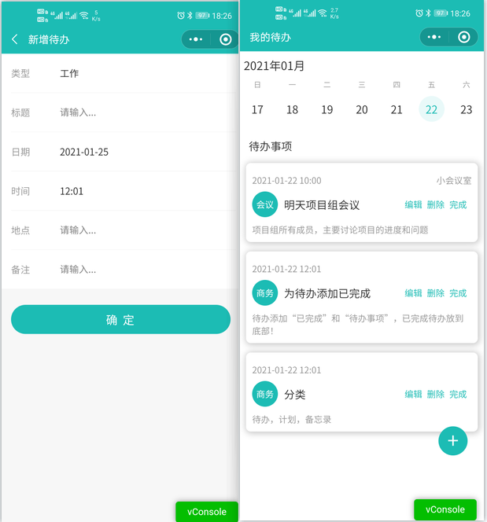

该项目是学习了云开发的基础文档之后自己搜的模板，加入自己的一些想法做的项目，纯为练手项目。
效果图如下：

## 开通云开发服务
点击微信开发者工具的“云开发”图标，在弹出框里点击“开通”，同意协议后，会弹出创建环境的对话框。这时会要求你输入环境名称，以及当前云开发的基础环境配额。

## 指定小程序的云开发环境
初次创建的时候在 cloudfunctions 文件夹名显示的不是环境名称，而是“未指定环境”，可以鼠标右键该文件夹，选择“更多设置”，然后再点击“设置”小图标，选择环境并确定。
在开发者工具中打开源代码文件夹 miniprogram 里的 app.js，在 env: 'my-env-id'处改成你的环境 ID。

## 部署并上传云函数 
在cloudfunctions/login文件，在右键菜单中选择在【终端】中打开，打开后在【终端】中输入以下代码npm install。
下载完成后，再右键 login 云函数目录，点击“上传并部署：所有文件”。

## 创建云数据库
在云开发控制台中，点击创建todos数据库，以备对待办的增删改查相关操作。

## 获取openid与云函数login
openid 是小程序用户的唯一标识，是每一个小程序用户都有一个唯一的 openid。只有login云函数上传并部署好之后，才能获取到openid。

## 注意事项
部署完成之后，建议重启开发环境，在cloudfunctions中右键配置好云开发环境，就可以使用。

## 项目说明
#### 需求分析：
- 新增待办
- 当日待办查看
- 待办编辑
- 待办删除
- 待办状态修改

#### 数据设计：
-  待办名称
-  待办分类
-  待办开始日期
-  待办地点
-  待办备注
-  待办状态（是否完成）

当日待办的查看，未来任务的记录，过去的待办查询，完全可以作为个人随手记或备忘录的小工具使用。
